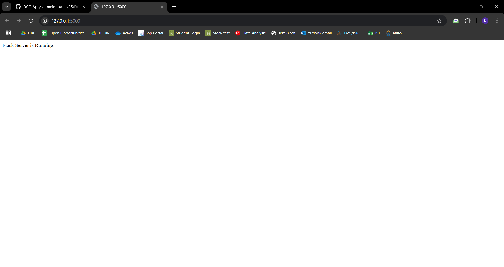
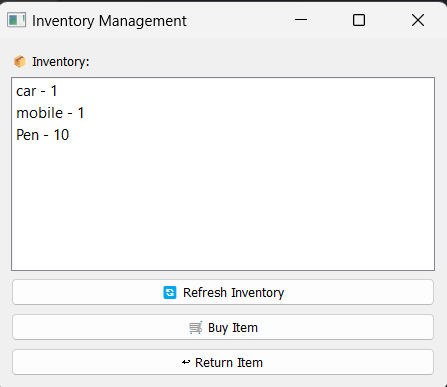

# DCC-App Python Assignment


## Setup

1. Clone the repository:
   ```sh
   git clone https://github.com/kapilk05/DCC-App.git
   cd DCC-App
   ```
2. Create and activate a virtual environment:
   ```sh
   python -m venv venv
   source venv/bin/activate  # On macOS/Linux
   venv\Scripts\activate     # On Windows
   ```
3. Install dependencies:
   ```sh
   pip install -r requirements.txt
   ```

---

## Running the Application

1. Start the Flask server:
   ```sh
   python server.py
   ```
   
2. The object transformations are defined under assignment.blend
   data object is containing object data that we store the transformation on 
   these changes are reflected in the flask terminal when run
   
   and the same can be seen on the running server at http://127.0.0.1:5000/get-transformations
   


### Inventory  (`page.py`)
- Add an item to inventory
- Remove an item
  


- List all items



### Flask API (`server.py`)
- `POST /add-item`: Add a new item with name and quantity
- `POST /remove-item`: Remove an item by name
- `GET /inventory`: Retrieve the entire inventory

### Blender Operations (`script.blend`)
- 3D visual representation of items (linked with inventory system)
- Automated modifications using Blender scripts


### Common Errors & Fixes
1. **`pytest` not recognized**
   - Ensure pytest is installed: `pip install pytest`
2. **Connection errors**
   - Make sure `server.py` is running before executing tests.
3. **Assertion errors (e.g., `400 != 201`)**
   - Check API request formats and ensure valid JSON data is sent.

---
Alternately you can use `pyinstaller` to package the application to run without a python enviornment

```sh
pip install pyinstaller
pyinstaller --onefile server.py
pyinstaller --onefile page.py
```

This will generate executable files in the `dist/` folder.

---

you can run python server.exe or python page.exe


This project video is at : 

